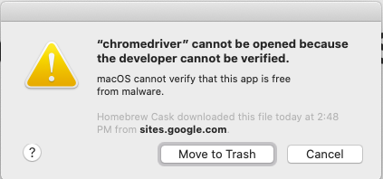
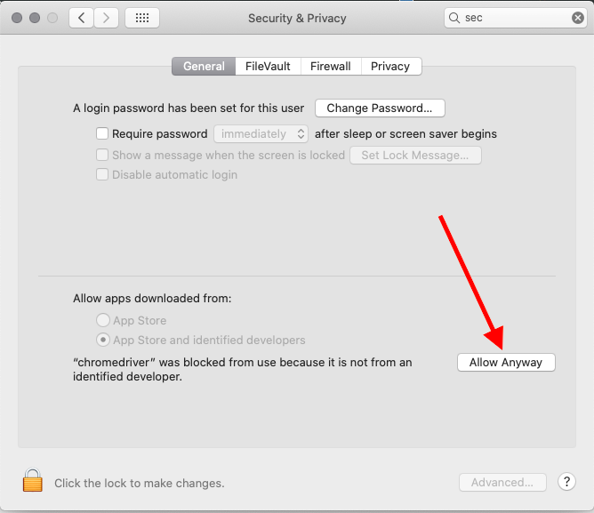
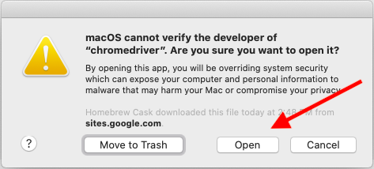

# Mission to Mars

## Background

Robin, who loves astronomy and wants to work for NASA one day, has decided to use a specific method of gathering the latest data: web scraping. Using this technique, she has the ability to pull data from multiple websites, store it in a database, then present the collected data in a central location: a webpage.

Robin wants to be kept up to date with different Mars news, and she's enjoyed the articles published on the NASA news website (Links to an external site.). For her project specifically she would like to extract the most recently published article's title and summary.

Robin knows that she will want to pull the top article and summary sentence.

Robin has carefully staked out the websites she wants to routinely scrape data from. It's her dream to eventually work for NASA, so that's part of why she's chosen two similar sites as sources. Another reason is that these sites have very friendly Terms of Service (or ToS, also known as Terms of Use) when it comes to web scraping.

Robin has finished her first Mars-related scrape. All of the practice and study is starting to pay off. It's a fantastic first step to creating her web application. The next step is to scrape the featured image from another Mars website. Once the image is scraped, we'll want to add it to our web app as well.

The next bit of information Robin wants to have included in her app is a collection of Mars facts. With news articles and high-quality images, a collection of facts is a solid addition to her web app.

She already has decided which webpage she'll use for fact scraping, but the information is held in a table format.

Robin has refactored her code so that it separates each scraping section into its own function, which will make reusing the code a much simpler task. She has already built out the Flask routes as well, which is an integral part of scraping—without the routes, the web app simply wouldn't function.

Robin has also set up a Mongo database to hold the data that gets scraped. The next step is to integrate Mongo into the web app. She wants the script to update the data stored in Mongo each time it's run.

## Overview of Project

Robin's web app is looking good and functioning well, but she wants to add more polish to it. She had been admiring images of Mars’s hemispheres online and realized that the site is scraping-friendly. She would like to adjust the current web app to include all four of the hemisphere images. To do this, you’ll use BeautifulSoup and Splinter to scrape full-resolution images of Mars’s hemispheres and the titles of those images, store the scraped data on a Mongo database, use a web application to display the data, and alter the design of the web app to accommodate these images.


### Purpose

Scrape 4 different websites to get Mars / NASA related data.

## Analysis And Challenges

## Methodology: Analytics Paradigm

#### 1. Decomposing the Ask

Since all the information required isn't easily available through API or dataset, we need to use splinter to traverse the different webpages to get the information required.

#### 2. Identify the Datasource
1. https://mars.nasa.gov/news/
2. https://spaceimages-mars.com
3. https://galaxyfacts-mars.com
4. https://marshemispheres.com/

#### 3. Define Strategy & Metrics
**Resource:** Python 3, Flask, Pandas, Jupyter Notebook, Splinter, Beautiful Soup, PyMongo, MongoDB, HTML5Lib, LXML

#### 4. Data Retrieval Plan

Use splinter to scrape the information from the different html/css tags.

#### 5. Assemble & Clean the Data

The data are mostly cleaned while scrapping.

#### 6. Analyse for Trends

#### 7. Acknowledging Limitations

##### The study material has a lot of problems for MacOS that needs troubleshooting

1. Mongodb: define mongo dbpath when starting mongodb.
```
mongod --dbpath /usr/local/var/mongodb
```
Can also look into defining this path permanently in /etc/ but not sure where it is supposed to be in Mac OS.

2. chromedriver for selenium installation method

```
pip install chromedriver
```
did not install chromedriver properly and therefore when running the python script, we received this error:
```
FileNotFoundError: [Errno 2] No such file or directory: 'chromedriver'
selenium.common.exceptions.WebDriverException: Message: 'chromedriver' executable needs to be in PATH. Please see https://chromedriver.chromium.org/home
```

Use brew to install properly.
```
brew install --cask chromedriver
```

Then use the steps below to ensure that everything will run smoothly

>chromedriver error when running the script after installing chromedriver properly



>Go to Security & Privacy settings and click "Allow Anyway"



>Run the script again and click "Open", you only need to do this once



3. Accessing mongo

the command below is deprecated
```
mongo
```

use this command below:
```
mongosh
```

4. Deprecated pyMongo command in python

update command is deprecated
```
mars.update({}, mars_data, upsert=True)
````
replace update with replace_one

```
mars.replace_one({}, mars_data, upsert=True)
```


#### 8. Making the Call:
The "Proper" Conclusion is indicated below on [Summary](#summary)

## Analysis

### Deliverable 3: Add Bootstrap 3 Components

1. Make the site mobile responsive

```
<meta name="viewport" content="width=device-width, initial-scale=1, maximum-scale=1, user-scalable=no">
```

2. make all 4 of the for hemipheres in one row

```

<div class="col-md-3">
	<div class="thumbnail">
```

3. Change the button colour to light green/blue with info
```
<p><a class="btn btn-info btn-lg" href="/scrape" role="button">Scrape New Data</a></p>
```


## Summary

This is a really fun project to gather data from different websites when there is no API or dataset available.

## Appendix
----
### Splinter

Splinter documentation: https://splinter.readthedocs.io/

Splinter provides 6 methods to finding elements:

```
browser.find_by_css('h1')
browser.find_by_xpath('//h1')
browser.find_by_tag('h1')
browser.find_by_name('name')
browser.find_by_text('Hello World!')
browser.find_by_id('firstheader')
browser.find_by_value('query')
```
----
### Beautiful soup information
```
https://www.crummy.com/software/BeautifulSoup/bs4/doc/
```
----
### Pymongo

see documentation on new updates:
* https://kb.objectrocket.com/mongo-db/how-to-update-a-mongodb-document-in-python-356
* https://pymongo.readthedocs.io/en/stable/api/pymongo/collection.html

check version
```
pip freeze | grep pymongo
pymongo==4.0.1
```
----
### Mongo Commands


* show which database you're working on
```
> db
practicedb
```

* switch database
```
> use practicedb
switched to db practicedb
```

* see how many databases are stored locally
```
> show dbs
admin   0.000GB
config  0.000GB
local   0.000GB
```

*insert one data
```
> db.zoo.insertOne({name: 'Cleo', species: 'jaguar', age: 12, hobbies: ['sleeping', 'eating', 'climbing']})
{
	"acknowledged" : true,
	"insertedId" : ObjectId("61dcb28affc5dd9365e44cfe")
}
```

* see what data are already in the db
```
> show collections
zoo
```

* view what's inside a collection with the find() command.
```
> db.zoo.find()
{ "_id" : ObjectId("61dcb28affc5dd9365e44cfe"), "name" : "Cleo", "species" : "jaguar", "age" : 12, "hobbies" : [ "sleeping", "eating", "climbing" ] }
{ "_id" : ObjectId("61dcb2c7ffc5dd9365e44cff"), "name" : "Banzai", "species" : "fox", "age" : 1, "hobbies" : [ "sleeping", "eating", "playing" ] }
```

* delete one document
```
> db.zoo.deleteOne({name: 'Cleo'})
{ "acknowledged" : true, "deletedCount" : 1 }
```

* delete one document
```
> db.zoo.deleteOne({name: 'Cleo'})
{ "acknowledged" : true, "deletedCount" : 1 }
```

* remove all collections
```
db.zoo.remove({})
```

* remove all collections
```
db.zoo.remove({})
```

* remove the whole zoo collection

```
db.zoo.drop()
```

* remove database
```
db.dropDatabase()
```

* show all databases
```
show dbs
```
